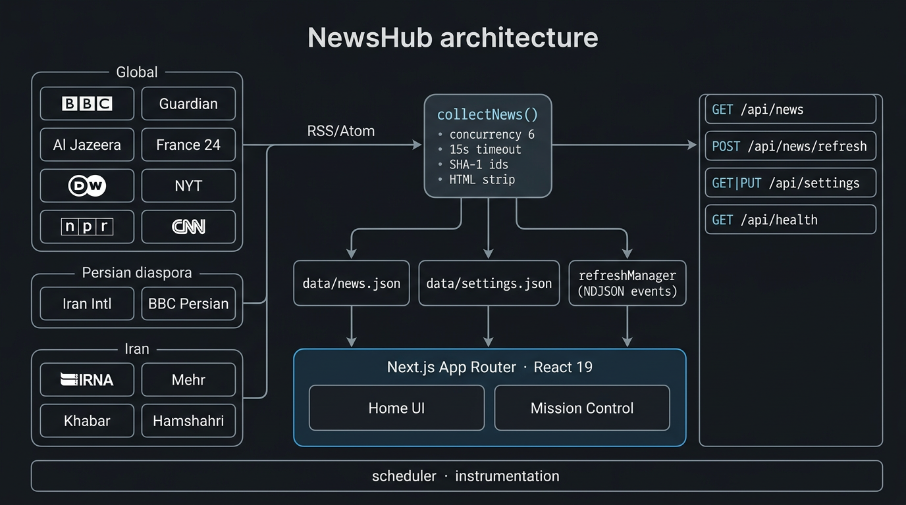
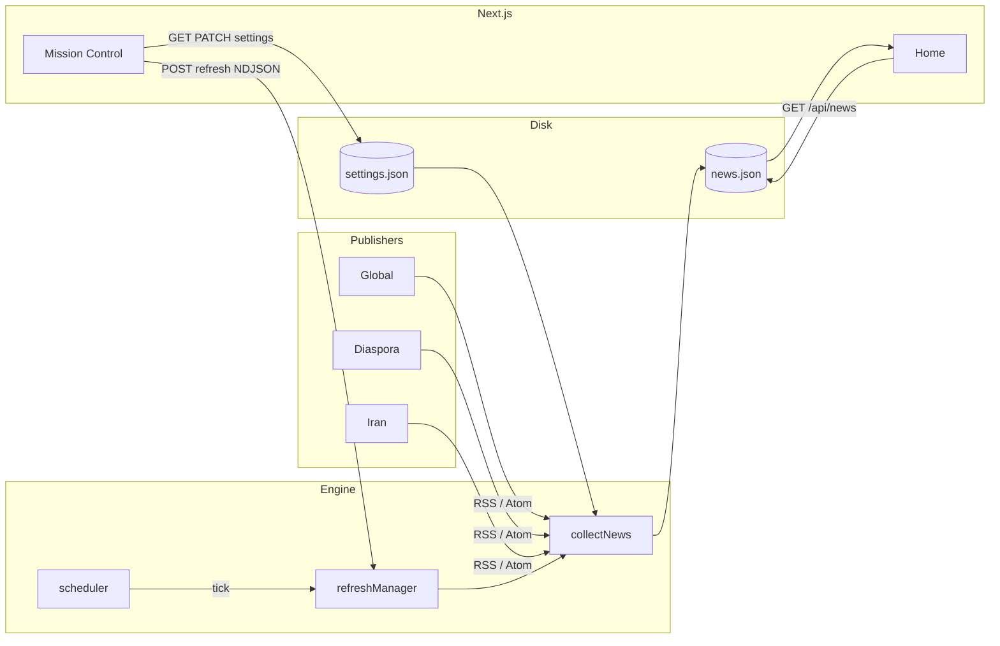
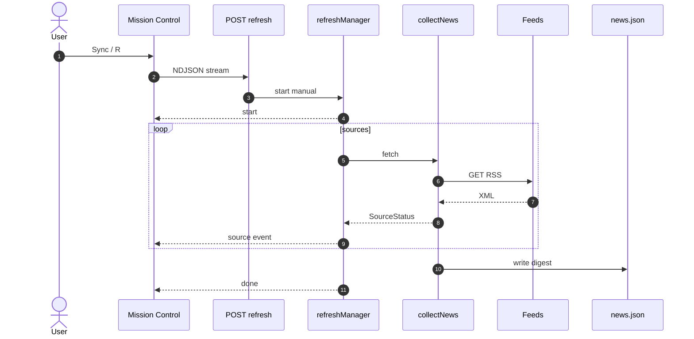
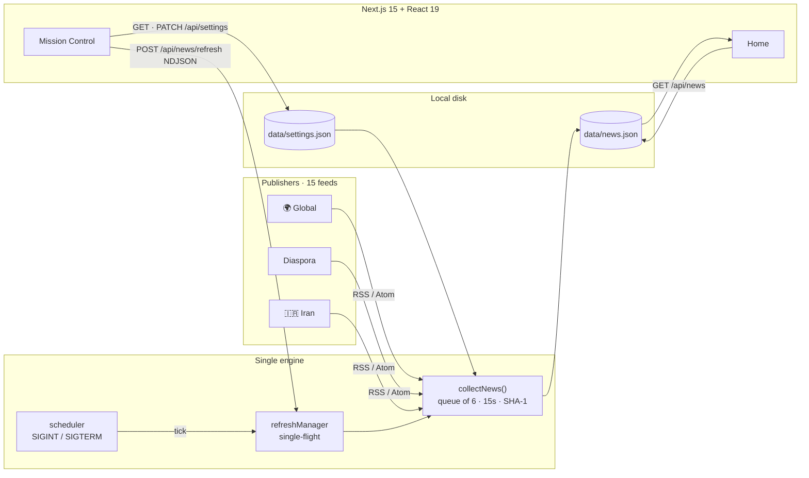
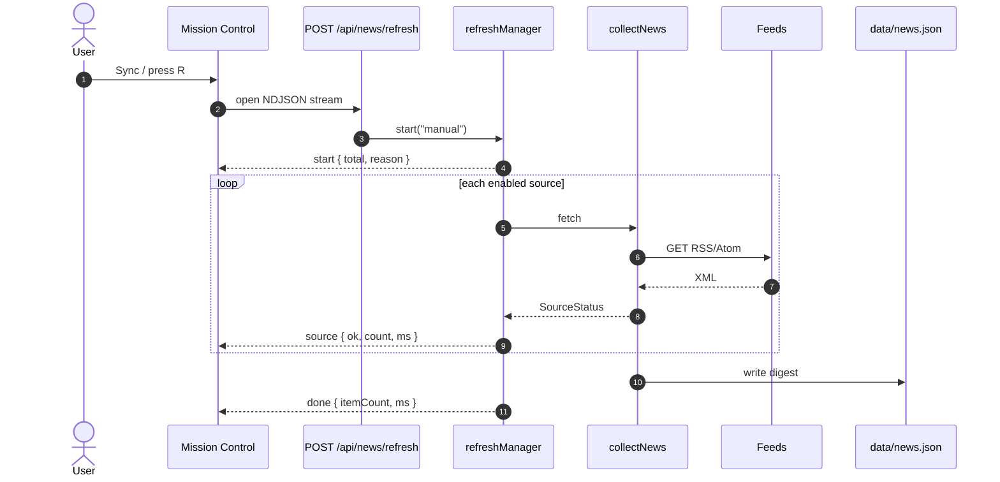

<div align="center" dir="rtl">

# نیوزهاب · NewsHub

**خوانندهٔ خبر محلی‌محور برای جهان و ایران — بدون ردیاب، بدون تصویر، یک فایل فشردهٔ JSON.**

[](package.json)
[](https://nextjs.org/)
[](https://react.dev/)
[](https://nodejs.org/)
[](https://www.typescriptlang.org/)
[](#مجوز)

[معرفی](#معرفی) · [ویژگی‌ها](#ویژگی‌ها) · [معماری](#معماری) · [شروع سریع](#شروع-سریع) · [English](#newshub)

</div>

---

<div dir="rtl">

## معرفی

**NewsHub** یک داشبورد خبری *local-first* است: خوراک‌های RSS/Atom را مستقیم از ناشران می‌گیرد، آن‌ها را در یک پنجرهٔ زمانی قابل تنظیم (۶ تا ۴۸ ساعت) فیلتر می‌کند و خلاصه‌ای فشرده — بدون تصویر و بدون اسکریپت شخص ثالث — روی ماشین خودتان نمایش می‌دهد.

سه بخش جداگانه:

| بخش | محتوا |
| --- | --- |
| 🌍 **جهانی** | بی‌بی‌سی، گاردین، الجزیره، فرانس ۲۴، دویچه‌وله، نیویورک‌تایمز، NPR، CNN |
|  **فارسی دیاسپورا** | ایران اینترنشنال، بی‌بی‌سی فارسی |
| 🇮🇷 **خبرهای جمهوری اسلامی** | ایرنا، مهر، ایسنا، خبرآنلاین، همشهری آنلاین |

موتور همگام‌سازی در زمان بیلد و در زمان اجرا یکی است. تنظیمات در `data/settings.json` ذخیره می‌شود و هم اسکریپت بیلد، هم زمان‌بند پس‌زمینه، و هم پنل «مرکز فرمان» از همان فایل پیروی می‌کنند.

---

## ویژگی‌ها

- **Local-first** — داده روی دیسک شماست (`data/news.json`). هیچ حساب کاربری، هیچ CDN خبری واسط.
- **بدون تصویر، بدون ردیاب** — payload معمولاً چند ده کیلوبایت است؛ حریم خصوصی و سرعت اولویت دارند.
- **مرکز فرمان (Mission Control)** — همگام‌سازی دستی با پیشرفت زندهٔ هر منبع (NDJSON)، پنجرهٔ زمانی، بازهٔ همگام‌سازی خودکار، روشن/خاموش کردن منابع.
- **زمان‌بند پس‌زمینه** — با خاموش شدن graceful روی `SIGINT`/`SIGTERM`؛ اگر داده منقضی شده باشد، همگام‌سازی اولیه تقریباً فوری است.
- **همگام‌سازی همزمان محدود** — صف کارگر با هم‌روندی ۶، تایم‌اوت ۱۵ ثانیه، چند URL جایگزین برای هر منبع فارسی.
- **پایداری شناسه** — مقاله‌های به‌روزشده / لایو بلاگ مهر زمانی اصلی خود را حفظ می‌کنند (تطبیق بر اساس URL).
- **جستجو و فیلتر** — تب منطقه، منبع، جستجوی عنوان/خلاصه، صفحه‌بندی ۳۰تایی.
- **تم روشن/تیره** — بدون چشمک (bootstrap در `<head>` از `localStorage` و `prefers-color-scheme`).
- **میانبر صفحه کلید** — `R` برای همگام‌سازی، `Esc` برای بستن پنل.
- **سلامت API** — `GET /api/health` برای مانیتورینگ.

---

## معماری

<p align="center">
  
</p>

<p align="center"><sub>شکل ۱ — مسیر داده از ناشر تا مرکز فرمان</sub></p>

### جریان کلی



### توالی همگام‌سازی زنده



| لایه | نقش |
| --- | --- |
| `src/server/newsService.ts` | واکشی، پاک‌سازی HTML، برش خلاصه (۱۸۰ نویسه)، فیلتر زمانی، ادغام با دادهٔ قبلی |
| `src/server/store.ts` | خواندن/نوشتن اتمیک JSON روی دیسک |
| `src/server/refreshManager.ts` | جلوگیری از همگام‌سازی موازی؛ پخش رویداد `start` / `source` / `done` / `error` |
| `src/server/scheduler.ts` | زمان‌بند تکی روی `globalThis` (مقاوم در برابر HMR) |
| `src/instrumentation.ts` | راه‌اندازی زمان‌بند هنگام بالا آمدن سرور Next |
| `src/lib/news-context.tsx` | وضعیت کلاینت، همگام‌سازی زنده، toast |
| `src/scripts/fetch-news.ts` | همان موتور برای `prebuild` و `npm run news` |

### قرارداد API

| روش | مسیر | توضیح |
| --- | --- | --- |
| `GET` | `/api/news` | آخرین خلاصه (`NewsData`) |
| `POST` | `/api/news/refresh` | شروع همگام‌سازی؛ بدنهٔ پاسخ **NDJSON** (`application/x-ndjson`) |
| `GET` | `/api/settings` | تنظیمات + رجیستری منابع |
| `PATCH` | `/api/settings` | ذخیرهٔ تنظیمات (از همگام‌سازی بعدی اعمال می‌شود) |
| `GET` | `/api/health` | وضعیت زنده بودن سرویس |

نمونهٔ رویدادهای همگام‌سازی:

```json
{"type":"start","total":15,"reason":"manual"}
{"type":"source","source":{"id":"bbc-world","ok":true,"count":12,"ms":340}}
{"type":"done","itemCount":180,"generatedAt":"2026-08-19T12:00:00.000Z","ms":4200}
```

---

## پشتهٔ فنی

| بخش | انتخاب |
| --- | --- |
| چارچوب | Next.js 15 (App Router، `runtime: nodejs`) |
| UI | React 19، Motion (`motion/react`) |
| استایل | Tailwind CSS 4 |
| خوراک | `rss-parser` + `fetch` بومی با `AbortSignal.timeout` |
| زبان | TypeScript 5.8، Node ≥ 20.18 |
| اجراکنندهٔ اسکریپت | `tsx` |

---

## شروع سریع

پیش‌نیاز: **Node.js 20.18 یا بالاتر**.

```bash
git clone https://github.com/Moarthy/NewsHub.git
cd NewsHub
npm install
npm run dev
```

سپس مرورگر را روی [http://localhost:3000](http://localhost:3000) باز کنید. اولین همگام‌سازی به‌صورت خودکار انجام می‌شود؛ پیشرفت را در **مرکز فرمان** ببینید.

### اسکریپت‌ها

| فرمان | کار |
| --- | --- |
| `npm run dev` | سرور توسعه |
| `npm run news` | فقط همگام‌سازی خوراک‌ها (بدون UI) |
| `npm run build` | `prebuild` همگام‌سازی می‌کند، سپس بیلد production |
| `npm start` | سرو کردن بیلد (`next start`) |

---

## پیکربندی

فایل `data/settings.json`:

```json
{
  "windowHours": 48,
  "autoRefreshMinutes": 0,
  "maxItems": 240,
  "sources": {
    "bbc-world": { "enabled": true }
  }
}
```

| کلید | معنی | مقادیر معمول |
| --- | --- | --- |
| `windowHours` | فقط اخبار تازه‌تر از این ساعت نگه داشته می‌شوند | `6` · `12` · `24` · `48` |
| `autoRefreshMinutes` | بازهٔ همگام‌سازی پس‌زمینه؛ `0` = خاموش | `0` · `15` · `30` · `60` · `180` · `360` · `720` |
| `maxItems` | سقف آیتم‌های ذخیره‌شده | پیش‌فرض `240` |
| `sources.<id>.enabled` | روشن/خاموش بودن هر منبع | `true` / `false` |

افزودن منبع جدید: یک ورودی به `src/lib/sources.json` اضافه کنید (`id`, `name`, `country`, `flag`, `region`, `lang`, `type`, `feeds[]`). منطقه باید یکی از `global` | `persian-diaspora` | `iran` باشد. چند URL در `feeds` به‌ترتیب امتحان می‌شوند.

ثابت‌های موتور در `newsService.ts`:

| ثابت | مقدار | نقش |
| --- | --- | --- |
| `TIMEOUT_MS` | ۱۵٬۰۰۰ | مهلت هر درخواست |
| `SUMMARY_CHARS` | ۱۸۰ | طول خلاصه |
| `MAX_PER_SOURCE` | ۳۰ | سقف آیتم از هر خوراک |
| `CONCURRENCY` | ۶ | تعداد واکشی موازی |
| `USER_AGENT` | `NewsHub/2.0 (local news digest)` | شناسایی مودبانه نزد ناشران |

---

## ساختار مخزن

```
NewsHub/
├── data/
│   ├── news.json              # خلاصهٔ تولیدشده (تولید زمان اجرا / بیلد)
│   └── settings.json          # تنظیمات پایدار
├── src/
│   ├── app/                   # App Router + مسیرهای API
│   ├── components/            # Header، NewsCard، ControlPanel، toast
│   ├── lib/                   # types، sources.json، context، highlight، api
│   ├── scripts/               # fetch-news.ts (و نسخهٔ .mjs)
│   ├── server/                # موتور همگام‌سازی، store، scheduler، logger
│   └── instrumentation.ts
├── next.config.ts
└── package.json
```

---

## حریم خصوصی و اخلاق داده

- هیچ کوکی تحلیلی، هیچ پیکسل تبلیغاتی، هیچ فونت خارجی اجباری.
- فقط عنوان، خلاصهٔ کوتاه، URL، زمان انتشار و فرادادهٔ منبع ذخیره می‌شود.
- حقوق محتوا متعلق به ناشران است؛ NewsHub یک **خوانندهٔ شخصی** است، نه بازنشرکننده. لینک‌ها به مطلب اصلی می‌روند.
- User-Agent شفاف است تا ناشران بتوانند ترافیک را تشخیص دهند.

---

## عیب‌یابی

| نشانه | اقدام |
| --- | --- |
| «Can't reach the local API» | مطمئن شوید `npm run dev` یا `npm start` در حال اجراست |
| منبع «offline» | خوراک ممکن است مسدود، کند یا نیازمند VPN باشد؛ URL جایگزین در `feeds` را بررسی کنید |
| تب خالی | پنجرهٔ زمانی را بزرگ‌تر کنید یا همگام‌سازی دستی از مرکز فرمان |
| همگام‌سازی گیر کرده | فقط یک شغل در لحظه اجرا می‌شود؛ رویداد `error` را در جریان NDJSON ببینید |

---

## مجوز

پروژه خصوصی است (`"private": true`). استفادهٔ شخصی و توسعهٔ محلی در نظر گرفته شده است. خوراک‌ها تحت شرایط ناشران مربوطه هستند.

---

<p align="center" dir="rtl"><sub>ساخته‌شده برای خواندن آرام خبر — روی دستگاه خودتان.</sub></p>

</div>

---

<div align="center">

# NewsHub

**A local-first news reader for the world and Iran — no trackers, no images, one compact JSON digest.**

[Features](#features) · [Architecture](#architecture) · [Quick start](#quick-start) · [Configuration](#configuration)

</div>

## Overview

**NewsHub** fetches RSS/Atom feeds **directly from publishers**, keeps only stories inside a configurable time window (6–48 hours), and renders a compact, image-free digest on your own machine.

Three desks:

| Desk | Sources |
| --- | --- |
| 🌍 **Global** | BBC, The Guardian, Al Jazeera, France 24, Deutsche Welle, The New York Times, NPR, CNN |
|  **Persian diaspora** | Iran International, BBC Persian |
| 🇮🇷 **RI's news** | IRNA, Mehr, ISNA, Khabar Online, Hamshahri Online |

The **same collection engine** runs at build time and at runtime. Settings live in `data/settings.json` and are honored by the build script, the in-process scheduler, and the Mission Control panel.

---

## Features

- **Local-first** — digest on disk (`data/news.json`). No accounts, no intermediary news CDN.
- **No images, no trackers** — payloads are typically tens of kilobytes.
- **Mission Control** — manual sync with per-source live progress (NDJSON), time window, auto-refresh interval, source toggles.
- **Background scheduler** — graceful shutdown on `SIGINT`/`SIGTERM`; near-immediate first sync when the digest is missing or stale.
- **Bounded concurrency** — worker queue (6), 15s timeouts, fallback feed URLs for Persian outlets.
- **Stable identities** — updated articles / live blogs keep their original timestamp (matched by URL).
- **Search & filters** — region tabs, source chips, headline search, “show more” pagination (30).
- **Light / dark theme** — no flash (head bootstrap from `localStorage` + `prefers-color-scheme`).
- **Keyboard** — `R` to sync, `Esc` to close the panel.
- **Health endpoint** — `GET /api/health`.

---

## Architecture

<p align="center">
  
</p>

<p align="center"><sub>Figure 1 — data path from publishers to Mission Control</sub></p>

### System flow



### Live sync sequence



| Module | Responsibility |
| --- | --- |
| `src/server/newsService.ts` | Fetch, HTML strip, 180-char excerpt, time filter, merge with previous digest |
| `src/server/store.ts` | Atomic JSON read/write |
| `src/server/refreshManager.ts` | Single-flight jobs; emit `start` / `source` / `done` / `error` |
| `src/server/scheduler.ts` | Singleton on `globalThis` (HMR-safe) |
| `src/instrumentation.ts` | Starts the scheduler when Next boots |
| `src/lib/news-context.tsx` | Client state, live sync, toasts |
| `src/scripts/fetch-news.ts` | Same engine for `prebuild` and `npm run news` |

### HTTP surface

| Method | Path | Notes |
| --- | --- | --- |
| `GET` | `/api/news` | Latest `NewsData` |
| `POST` | `/api/news/refresh` | Start a sync; response is **NDJSON** |
| `GET` | `/api/settings` | Settings + source registry |
| `PATCH` | `/api/settings` | Persist settings (applied on the next sync) |
| `GET` | `/api/health` | Liveness |

---

## Tech stack

| Layer | Choice |
| --- | --- |
| Framework | Next.js 15 (App Router, Node runtime) |
| UI | React 19, Motion |
| Styling | Tailwind CSS 4 |
| Feeds | `rss-parser` + native `fetch` + `AbortSignal.timeout` |
| Language | TypeScript 5.8, Node ≥ 20.18 |
| Scripts | `tsx` |

---

## Quick start

Requires **Node.js 20.18+**.

```bash
git clone https://github.com/Moarthy/NewsHub.git
cd NewsHub
npm install
npm run dev
```

Open [http://localhost:3000](http://localhost:3000). The first sync runs automatically; watch progress in **Mission Control**.

| Script | Purpose |
| --- | --- |
| `npm run dev` | Development server |
| `npm run news` | Fetch feeds only (no UI) |
| `npm run build` | `prebuild` syncs, then production build |
| `npm start` | Serve the production build |

---

## Configuration

`data/settings.json`:

```json
{
  "windowHours": 48,
  "autoRefreshMinutes": 0,
  "maxItems": 240,
  "sources": {
    "bbc-world": { "enabled": true }
  }
}
```

| Key | Meaning | Typical values |
| --- | --- | --- |
| `windowHours` | Keep stories newer than this | `6` · `12` · `24` · `48` |
| `autoRefreshMinutes` | Background interval; `0` = off | `0` · `15` · `30` · `60` · `180` · `360` · `720` |
| `maxItems` | Cap stored items | default `240` |
| `sources.<id>.enabled` | Per-source switch | `true` / `false` |

To add a source, append an object to `src/lib/sources.json`. `region` must be `global` | `persian-diaspora` | `iran`. Multiple `feeds` URLs are tried in order.

Engine constants (`newsService.ts`): timeout **15s**, excerpt **180** chars, **30** items per source, concurrency **6**, User-Agent `NewsHub/2.0 (local news digest)`.

---

## Repository layout

```
NewsHub/
├── data/                 # news.json + settings.json
├── src/app/              # App Router + API routes
├── src/components/       # UI (Mission Control, cards, toasts)
├── src/lib/              # types, registry, client context
├── src/scripts/          # CLI collector
├── src/server/           # engine, store, scheduler, logger
└── src/instrumentation.ts
```

---

## Privacy

No analytics cookies, ad pixels, or required third-party fonts. Only title, short summary, URL, publish time, and source metadata are stored. Copyright remains with publishers — NewsHub is a **personal reader**, not a republisher. Links always go to the original article.

---

## Troubleshooting

| Symptom | What to do |
| --- | --- |
| “Can't reach the local API” | Ensure `npm run dev` or `npm start` is running |
| Source marked offline | Feed may be blocked, slow, or need a VPN; check fallback URLs |
| Empty tab | Widen the time window or trigger a manual sync |
| Sync appears stuck | Only one job runs at a time; inspect the NDJSON `error` event |

---

## License

Private package (`"private": true`). Intended for personal, local use. Feed content is subject to each publisher’s terms.

<p align="center"><sub>Built for quiet reading — on your own hardware.</sub></p>
