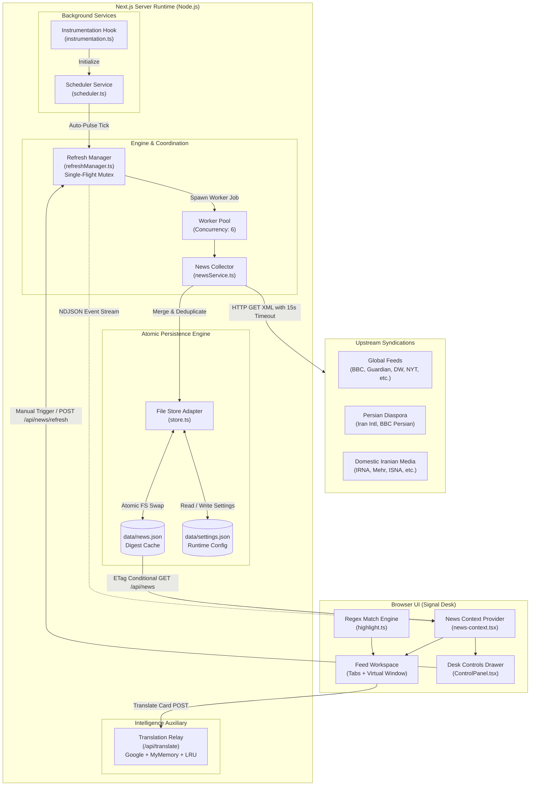

# Signal Desk · NewsHub

<div align="center">

**A high-density, local-first intelligence reader for global affairs and Iranian geopolitics.**  
*Zero trackers. Zero remote images. Single-file compact storage. Sub-second response times.*

[](package.json)
[](https://nextjs.org/)
[](https://react.dev/)
[](https://www.typescriptlang.org/)
[](https://tailwindcss.com/)
[](https://motion.dev/)
[](https://nodejs.org/)
[](#privacy--data-ethics)

[Overview](#overview) • [Core Philosophy](#core-philosophy) • [Architecture](#architecture) • [Wire Sources](#wire-sources) • [API Reference](#api-reference) • [Quick Start](#quick-start) • [Configuration](#configuration) • [Production Deployment](#production-deployment)

</div>

---

## Overview

**NewsHub** (branded on the wire as **Signal Desk**) is a self-hosted, local-first news digest built for researchers, analysts, and readers who need raw, unfiltered news streams without algorithmic manipulation, intrusive tracking pixels, or heavy multimedia payloads.

Traditional modern news platforms consume megabytes of network bandwidth delivering advertising telemetry, third-party analytics scripts, and paywall bloat. NewsHub reverses this paradigm:

- **Local-First Wire Aggregation:** Directly polls 15 authoritative primary RSS and Atom feeds across international broadcasters, Persian diaspora outlets, and domestic Iranian state media.
- **Bounded Rolling Horizon:** Restricts intake to a strictly configured temporal window (6 to 48 hours; default 12 hours). Stale content is automatically retired from the workspace.
- **Single-Flight Synchronization:** Multi-consumer deduplicated sync orchestrator with streaming NDJSON progress indicators, bounded concurrency (6 workers), and fallback upstream URLs.
- **Privacy & Bandwidth Preservation:** Drops images, strips tracking markup and HTML tags, parses XML directly on your Node runtime, and saves the digest into an atomic, low-overhead JSON file on disk.
- **Embedded Translation Pipeline:** Integrated English-to-Persian translation relay featuring LRU-cached multi-upstream failover (Google GTX & MyMemory) and bi-directional RTL text isolation.

---

## Core Philosophy

### 1. Tri-Regional Editorial Triangulation
News reporting in contested geopolitical spheres is intensely fragmented. NewsHub places contrasting editorial lenses side-by-side to allow instant cross-verification:
1. **Global Broadcasters:** BBC World, Reuters-style neutral feeds, The Guardian, Al Jazeera, France 24, Deutsche Welle, The New York Times, NPR, and CNN.
2. **Persian Diaspora Outlets:** Independent Persian-language reporting from London and Washington (e.g., Iran International, BBC Persian).
3. **Domestic Iranian State & Semiofficial Press:** Direct monitoring of internal publications and state wires (IRNA, Mehr News, ISNA, Khabaronline, Hamshahri Online) for primary official statements and domestic rhetoric.

### 2. Zero-Surveillance & Minimalist Payload
NewsHub acts as an air-gap between your web browser and the publisher. When you view headlines, no remote tracking beacons, JavaScript trackers, or third-party ad networks are contacted. All remote network requests occur strictly on your private Node.js backend. The frontend client downloads a compact JSON payload (typically 30–70 KB gzip), enabling near-instantaneous search and filtering.

### 3. Resilient Operational Continuity
Designed to withstand upstream feed censorship, temporary network dropouts, and DNS throttling. Persian news wires include automated fallback endpoints. If an HTTP request fails, the parser inspects error cause chains, records per-source response latencies, and maintains previously captured stories within the active time window.

---

## Architecture

<div align="center">
  
  <p><em>Figure 1: Data flow from upstream news syndications to the Signal Desk dashboard.</em></p>
</div>

### System Topology



### Key Architectural Subsystems

#### 1. Single-Flight Streaming Orchestrator (`src/server/refreshManager.ts`)
Concurrent refresh requests (e.g., automated scheduler ticks coinciding with multiple manual dashboard triggers) are collapsed into a single execution. The engine maintains an event log replay buffer with monotonic sequence counters (`seq`). Secondary subscribers immediately receive a synchronized event replay followed by real-time streaming updates over `application/x-ndjson`.

#### 2. Worker Queue & Error Introspection (`src/server/newsService.ts`)
- **Bounded Concurrency:** A queue worker operates with a concurrency ceiling of 6 simultaneous network requests to avoid upstream rate-limits and socket starvation.
- **Failover Resolution:** Sources declare ordered feed arrays. If the primary feed errors, fallback URLs are sequentially negotiated before marking the source offline.
- **Deep Cause Traversal:** `describeFetchError` inspects nested `.cause` objects up to 6 levels deep, providing actionable diagnostics (e.g., `fetch failed → connect ETIMEDOUT 104.22.x.x:443`).
- **Identity Preservation:** News items receive a deterministic 12-character SHA-1 identifier computed from their canonical URL. Updated articles and live blogs preserve their original creation timestamp to prevent artificial feed hopping while respecting the rolling retention window.

#### 3. Atomic Disk Storage (`src/server/store.ts`)
All file writes are performed via `atomicWrite`: content is piped to a PID-tagged temporary file (`data/news.json.<PID>.tmp`) before executing an atomic `fs.rename`. This guarantees that readers never encounter partial or corrupt JSON structures during process reboots or high-frequency refreshes. In-memory `mtimeMs` caches bypass disk I/O when the underlying files are unchanged.

#### 4. Background Scheduler & Lifecycle Management (`src/server/scheduler.ts`)
Next.js 16 instrumentation (`src/instrumentation.ts`) auto-starts the scheduling daemon on server boot. The scheduler dynamically measures data staleness against `windowHours` and executes an immediate refresh (1.5s delay) if the on-disk digest has expired. It binds listeners to `SIGTERM` and `SIGINT` for clean resource teardown in containerized environments.

#### 5. Adaptive Bilingual Translation Relay (`src/app/api/translate/route.ts`)
Headlines and excerpts can be dynamically translated to Persian directly inside the card view. The backend uses a dual-engine architecture:
- **Primary Engine:** Google GTX Translate endpoint with custom query formatting.
- **Secondary Engine:** MyMemory Translated API featuring strict UTF-8 450-byte text boundary chunking.
- **Adaptive Memory:** Tracks the last successful provider index (`preferredIndex`) to bypass broken upstreams on successive requests.
- **In-Memory LRU Cache:** 600-entry capacity keyed by `sha1(text)` for zero-latency repeats.

---

## Wire Sources

Signal Desk aggregates 15 pre-configured wires organized into three geopolitical sectors:

| Sector | Source Name | Country | Type | Primary Language | Fallback Feeds |
| :--- | :--- | :--- | :--- | :---: | :---: |
| **Global** | BBC News | 🇬🇧 United Kingdom | Public Broadcaster | English | 1 |
| **Global** | The Guardian | 🇬🇧 United Kingdom | Daily Newspaper | English | 1 |
| **Global** | Al Jazeera English | 🇶🇦 Qatar | International Broadcaster | English | 1 |
| **Global** | France 24 | 🇫🇷 France | Public Broadcaster | English | 1 |
| **Global** | Deutsche Welle (DW) | 🇩🇪 Germany | Public Broadcaster | English | 1 |
| **Global** | The New York Times | 🇺🇸 United States | Daily Newspaper | English | 1 |
| **Global** | NPR | 🇺🇸 United States | Public Radio | English | 1 |
| **Global** | CNN World | 🇺🇸 United States | Commercial Broadcaster | English | 1 |
| **Persian Diaspora** | Iran International (`ایران اینترنشنال`) | 🇬🇧 United Kingdom | News Network | Persian | 2 (Primary + RSS) |
| **Persian Diaspora** | BBC Persian (`بی‌بی‌سی فارسی`) | 🇬🇧 United Kingdom | Broadcaster | Persian | 2 (Primary + Backup) |
| **Islamic Republic** | IRNA News Agency (`خبرگزاری ایرنا`) | 🇮🇷 Iran | Official State Agency | Persian | 2 (RSS + Feed) |
| **Islamic Republic** | Mehr News Agency (`خبرگزاری مهر`) | 🇮🇷 Iran | Semiofficial Agency | Persian | 2 (RSS + Feed) |
| **Islamic Republic** | ISNA (`خبرگزاری ایسنا`) | 🇮🇷 Iran | Semiofficial Agency | Persian | 2 (RSS + Feed) |
| **Islamic Republic** | KhabarOnline (`خبرآنلاین`) | 🇮🇷 Iran | News Portal | Persian | 2 (RSS + Feed) |
| **Islamic Republic** | Hamshahri Online (`همشهری آنلاین`) | 🇮🇷 Iran | Metropolitan Daily | Persian | 2 (RSS + Feed) |

*Note: Sources can be toggled on or off individually within the Desk Controls drawer.*

---

## Technical Stack

| Layer | Technology | Version | Purpose |
| :--- | :--- | :--- | :--- |
| **Framework** | [Next.js](https://nextjs.org/) | `16.3.4` | App Router, Server Components, Route Handlers, Node runtime |
| **UI Library** | [React](https://react.dev/) | `19.2.8` | Declarative UI, Concurrent features, Context API |
| **Language** | [TypeScript](https://www.typescriptlang.org/) | `7.0.2` | End-to-end static type safety |
| **Styling** | [Tailwind CSS](https://tailwindcss.com/) | `4.1.8` | Next-generation CSS variables engine & PostCSS integration |
| **Animation** | [Motion](https://motion.dev/) | `13.2.0` | Hardware-accelerated transitions, gestures, and layout physics |
| **Feed Engine** | [rss-parser](https://github.com/rbren/rss-parser) | `3.13.0` | Robust parsing of RSS 2.0, RSS 0.9x, and Atom 1.0 specifications |
| **CLI Runner** | [tsx](https://github.com/privatenumber/tsx) | `4.23.13` | TypeScript execution for prebuild and standalone seed scripts |
| **Typography** | [Vazirmatn](https://github.com/rastikerdar/vazirmatn) | Embedded | Variable Persian/Arabic webfont bundled locally in WOFF2 |

---

## User Interface & Experience

Signal Desk is modeled after high-speed financial terminals and operational command centers:

- **Monospace Signal Status:** Real-time feedback bar displaying wire state (`LIVE FEED` vs `SYNCING`), active dispatch counts, and retention window.
- **Bilingual Typographic Engine:** Seamlessly handles Latin serif/sans typography alongside the embedded `Vazirmatn` Persian variable font with accurate Unicode directionality (`dir="rtl"` / `dir="ltr"`).
- **Keyboard-Driven Productivity:**
  - Press <kbd>R</kbd> anywhere on the desk to initiate an instant wire synchronization pulse.
  - Press <kbd>Esc</kbd> to dismiss modal overlays and control drawers.
  - Full keyboard focus trap and cycle navigation within the **Desk Controls** drawer.
- **Live Search & Highlighting:** Case-insensitive, regex-escaped full-text scanning that indexes titles, summaries, and source names simultaneously.
- **Adaptive Color Themes:** System-aware Dark and Light modes featuring high-contrast wire styling, ambient pulse glows, and reduced-motion fallbacks.

---

## API Reference

The backend exposes a lightweight, fully typed REST and streaming API.

### 1. `GET /api/news`
Fetches the current aggregated news digest.

- **Headers Supported:** `If-None-Match` (returns `304 Not Modified` if data has not changed).
- **Responses:**
  - `200 OK`: Returns full digest payload.
  - `304 Not Modified`: Cached browser state is fresh.
  - `503 Service Unavailable`: Server is bootstrapping the initial feed run.

```json
{
  "generatedAt": "2026-09-04T12:00:00.000Z",
  "windowHours": 12,
  "itemCount": 240,
  "items": [
    {
      "id": "e4f8b2d1c0a9",
      "title": "Diplomatic Talks Reconvene in Geneva Regarding Regional Security",
      "summary": "Delegates met early this morning to formalize the multilateral verification protocols...",
      "url": "https://feeds.bbci.co.uk/news/world-12345678",
      "publishedAt": "2026-09-04T11:42:00.000Z",
      "sourceId": "bbc-world",
      "sourceName": "BBC News",
      "country": "United Kingdom",
      "flag": "🇬🇧",
      "region": "global",
      "lang": "en"
    }
  ],
  "sources": [
    {
      "id": "bbc-world",
      "name": "BBC News",
      "country": "United Kingdom",
      "flag": "🇬🇧",
      "region": "global",
      "type": "Broadcaster",
      "ok": true,
      "count": 28,
      "ms": 420
    }
  ]
}
```

---

### 2. `POST /api/news/refresh`
Triggers an on-demand synchronization pass. Streams progress events using **Newline-Delimited JSON (NDJSON)** over a live `ReadableStream`.

- **Response Content-Type:** `application/x-ndjson; charset=utf-8`

#### Event Stream Format:
```json
{"type":"start","total":15,"reason":"manual"}
{"type":"source","source":{"id":"bbc-world","name":"BBC News","country":"United Kingdom","flag":"🇬🇧","region":"global","type":"Broadcaster","ok":true,"count":28,"ms":340}}
{"type":"source","source":{"id":"irna-fa","name":"خبرگزاری ایرنا","country":"ایران","flag":"🇮🇷","region":"iran","type":"خبرگزاری","ok":true,"count":22,"ms":580}}
{"type":"done","itemCount":240,"generatedAt":"2026-09-04T12:05:00.000Z","ms":1820}
```

---

### 3. `GET /api/settings`
Returns current active settings alongside the complete source registry definition.

```json
{
  "settings": {
    "windowHours": 12,
    "autoRefreshMinutes": 180,
    "maxItems": 240,
    "sources": {
      "bbc-world": { "enabled": true }
    }
  },
  "registry": [ /* Source definitions */ ]
}
```

---

### 4. `PATCH /api/settings`
Updates runtime desk settings. Validates input bounds, writes changes atomically to `data/settings.json`, and recalculates background scheduler timers.

- **Request Body:**
```json
{
  "windowHours": 24,
  "autoRefreshMinutes": 60,
  "maxItems": 300,
  "sources": {
    "cnn": { "enabled": false }
  }
}
```

---

### 5. `POST /api/translate`
Bilingual helper endpoint that translates English texts into Persian.

- **Request Body:**
```json
{
  "texts": [
    "UN Security Council votes unanimously on emergency resolution."
  ]
}
```
- **Response:**
```json
{
  "translations": [
    "شورای امنیت سازمان ملل به اتفاق آرا به قطعنامه اضطراری رای داد."
  ]
}
```

---

### 6. `GET /api/health`
Operational readiness probe for container orchestrators and monitoring tools.

```json
{
  "ok": true,
  "node": "v22.15.0",
  "uptimeSec": 43200,
  "stories": 240,
  "generatedAt": "2026-09-04T12:00:00.000Z",
  "refreshing": false
}
```

---

## Quick Start

### Prerequisites
- **Node.js:** `>= 20.18.0` (LTS recommended)
- **Package Manager:** `npm`, `pnpm`, or `yarn`

### Installation & Local Setup

1. **Clone the repository:**
   ```bash
   git clone https://github.com/Moarthy/NewsHub.git
   cd NewsHub
   ```

2. **Install dependencies:**
   ```bash
   npm install
   ```

3. **Perform an initial news build:**
   ```bash
   npm run news
   ```
   *This fetches live feeds across all enabled sources and populates `data/news.json`.*

4. **Start the development server:**
   ```bash
   npm run dev
   ```

5. **Access the desk:**
   Open [http://localhost:3000](http://localhost:3000) in your web browser.

---

## Scripts & CLI Commands

| Command | Action |
| :--- | :--- |
| `npm run dev` | Boots the Next.js local development server on port `3000`. |
| `npm run news` | Runs a standalone CLI sync using `tsx src/scripts/fetch-news.ts`. |
| `npm run prebuild` | Automatically runs prior to `next build` to pre-seed static digests. |
| `npm run build` | Compiles optimized Next.js server production bundle. |
| `npm start` | Launches production server with active background schedulers. |

---

## Configuration

Settings are saved in `data/settings.json`. You can modify them directly or configure them via the in-app **Desk Controls** panel.

### Settings Specification (`data/settings.json`)

```json
{
  "windowHours": 12,
  "autoRefreshMinutes": 180,
  "maxItems": 240,
  "sources": {
    "bbc-world": { "enabled": true },
    "guardian-world": { "enabled": true },
    "aljazeera": { "enabled": true },
    "france24": { "enabled": true },
    "dw": { "enabled": true },
    "nyt": { "enabled": true },
    "npr": { "enabled": true },
    "cnn": { "enabled": true },
    "iran-intl-fa": { "enabled": true },
    "bbc-persian": { "enabled": true },
    "irna-fa": { "enabled": true },
    "mehr-fa": { "enabled": true },
    "isna-fa": { "enabled": true },
    "khabaronline-fa": { "enabled": true },
    "hamshahrionline-fa": { "enabled": true }
  }
}
```

### Parameter Constraints

| Parameter | Type | Allowed Values | Default | Purpose |
| :--- | :---: | :---: | :---: | :--- |
| `windowHours` | `integer` | `1` to `48` | `12` | Stories published earlier than `now - windowHours` are discarded. |
| `autoRefreshMinutes` | `integer` | `0, 15, 30, 60, 180, 360, 720` | `180` | Background sync interval (`0` disables automated background polling). |
| `maxItems` | `integer` | `10` to `1000` | `240` | Maximum total story threshold preserved in memory and storage. |
| `sources` | `object` | Key-value booleans | All `true` | Granular per-source enable/disable flags. |

---

## Production Deployment

### Option A: Standard Node.js Host with PM2

1. Build the production application:
   ```bash
   npm run build
   ```

2. Start the service with [PM2](https://pm2.keymetrics.io/):
   ```bash
   pm2 start npm --name "newshub" -- start
   ```

3. Configure log persistence and process restarts:
   ```bash
   pm2 save
   pm2 startup
   ```

---

### Option B: Docker Container

Create a production-ready `Dockerfile`:

```dockerfile
FROM node:22-alpine AS base

WORKDIR /app

# Install build dependencies
COPY package*.json ./
RUN npm ci

# Copy source and compile
COPY . .
RUN npm run build

# Ensure data directory exists and is writable
RUN mkdir -p /app/data && chown -R node:node /app/data

USER node
EXPOSE 3000
ENV PORT=3000
ENV NODE_ENV=production

CMD ["npm", "start"]
```

Run with persistent data storage:

```bash
docker build -t newshub:latest .
docker run -d \
  --name signal-desk \
  -p 3000:3000 \
  -v $(pwd)/data:/app/data \
  --restart unless-stopped \
  newshub:latest
```

---

## Repository Layout

```
NewsHub/
├── data/
│   ├── news.json                   # Aggregated and normalized wire digest
│   └── settings.json               # Persisted user settings and source flags
├── docs/
│   └── architecture.png            # Visual architecture diagram
├── public/
│   ├── emoji/                      # Bundled Lion and Sun assets (no external network)
│   └── fonts/                      # Embedded Vazirmatn variable font
├── src/
│   ├── app/
│   │   ├── api/
│   │   │   ├── health/route.ts     # Health and diagnostic probe
│   │   │   ├── news/
│   │   │   │   ├── refresh/route.ts# NDJSON streaming refresh endpoint
│   │   │   │   └── route.ts        # ETag-enabled news digest API
│   │   │   ├── settings/route.ts   # Settings retrieval & PATCH mutation
│   │   │   └── translate/route.ts  # Fallback translation relay with LRU cache
│   │   ├── globals.css             # Tailwind 4 theme, layout rules, animations
│   │   ├── layout.tsx              # Root HTML layout, theme injector, viewport
│   │   └── page.tsx                # Signal Desk workspace, tab manager, search
│   ├── components/
│   │   ├── AnimatedNumber.tsx      # Smooth number transition counters
│   │   ├── ControlPanel.tsx        # Desk controls slideover & source toggles
│   │   ├── Header.tsx              # Masthead, pulse status, theme switcher
│   │   ├── icons.tsx               # Lightweight inline SVG icon collection
│   │   ├── LionSunFlag.tsx         # Local Lion and Sun badge component
│   │   ├── NewsCard.tsx            # Story item card with inline translation
│   │   ├── ProgressRing.tsx        # Vector radial progress & activity spinner
│   │   ├── providers.tsx           # Context providers and toast wrappers
│   │   └── toast.tsx               # Ephemeral feedback alerts
│   ├── lib/
│   │   ├── api.ts                  # Client fetch wrappers and stream consumers
│   │   ├── highlight.ts            # Regex-safe text splitting and mark injector
│   │   ├── news-context.tsx        # React context holding news state & hooks
│   │   ├── sources.json            # Static definitions for all 15 news feeds
│   │   ├── time.ts                 # Relative time formatting and duration calculations
│   │   └── types.ts                # TypeScript domain models and interfaces
│   ├── scripts/
│   │   └── fetch-news.ts           # Standalone CLI sync & build-time hook
│   ├── server/
│   │   ├── logger.ts               # Timestamped console logging utility
│   │   ├── newsService.ts          # Core feed ingestion, worker pool & sanitizer
│   │   ├── refreshManager.ts       # Single-flight mutex & NDJSON event broadcaster
│   │   ├── scheduler.ts            # Automatic background polling daemon
│   │   └── store.ts                # Atomic disk I/O, validator, and memory cache
│   └── instrumentation.ts          # Next.js server lifecycle hook (starts scheduler)
├── next.config.ts                  # Next.js engine configuration
├── package.json                    # Dependencies, engine versions, and scripts
├── postcss.config.mjs              # PostCSS plugins for Tailwind CSS v4
└── tsconfig.json                   # Strict TypeScript compiler options
```

---

## Privacy & Data Ethics

NewsHub is designed with fundamental digital sovereignty and privacy guarantees:

1. **No External Analytics:** Google Analytics, Mixpanel, Segment, or tracking pixels are strictly absent from the codebase.
2. **No Remote Media Requests:** Images from external news networks are never rendered in the client. This eliminates remote IP sniffing, browser fingerprinting, and tracking cookies across reading sessions.
3. **Local Vector & Web Assets:** All visual components—including the Persian Lion and Sun insignia and Vazirmatn variable font—are bundled locally in the repository.
4. **Direct Publisher Communication:** Feed requests are issued directly from your host IP to the publisher's origin server with a standard, identifiable user agent (`NewsHub/2.x`), respecting web standards without commercial intermediary crawlers.

---

## Troubleshooting

### Feed Outages & Firewall Circumvention
- **Domestic Iranian Outlets:** Certain Iranian government servers periodically throttle or geofence international IP addresses. If a source marks itself as `offline` in Desk Controls, check the error message in the status badge (`connect ETIMEDOUT` or `HTTP 403`).
- **Timeouts:** The default timeout per feed is 15 seconds. If operating over slow or high-latency connections, ensure your DNS resolvers (e.g., `1.1.1.1` or `8.8.8.8`) resolve the domains correctly.

### Port Conflicts
By default, Next.js listens on port `3000`. To customize:
```bash
PORT=8080 npm start
```

---

## License

This project is private software maintained by [Moarthy](https://github.com/Moarthy). All rights reserved.
For licensing inquiries, upstream syndication policies, or permissions, please refer to the repository owner.
